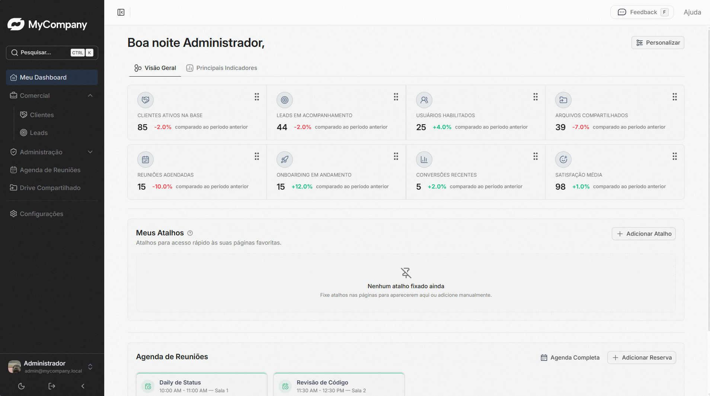

# Vue Dashboard Template



<center>

<br>

Preview: <a href="https://mycompany-dashboard.vercel.app/">https://mycompany-dashboard.vercel.app/</a>

</center>

Template genérico de dashboard administrativo com Vue 3, TypeScript, Pinia, Vue Router e Nuxt UI v4. O projeto foi preparado para servir como base reutilizável, com autenticação mock local e módulos administrativos prontos para customização.

## Stack principal

- Vue 3 w/ TypeScript Vite, Vue Router & Pinia
- Nuxt UI v4
- Tailwind CSS
- ESLint & Prettier

## Visão geral

O template mantém a estrutura original do projeto e substitui os módulos específicos por funcionalidades genéricas comuns em sistemas administrativos:

- Dashboard inicial com visão geral
- Clientes com CRUD local
- Leads com CRUD local
- Usuários com CRUD local
- Drive compartilhado com dados mockados
- Agenda de reuniões com dados mockados

Todas as interfaces seguem o padrão visual já existente e utilizam componentes do Nuxt UI.

## Autenticação

O login funciona localmente, sem backend, usando Pinia para controle de sessão.

- Usuário: `admin`
- Senha: `admin123`

Os campos da tela de login já são carregados com esses valores por padrão.

## Pré-requisitos

- Node.js 20+
- pnpm 10+

## Executar

```bash
pnpm install
pnpm dev
```

## Estrutura

```txt
src/
  components/   # Componentes compartilhados e modais
  composables/  # Regras reutilizáveis e estado local dos mocks
  layouts/      # Layouts da aplicação
  pages/        # Páginas e módulos do dashboard
  router/       # Rotas da aplicação
  stores/       # Stores globais com Pinia
  utils/        # Mocks, tipos, mapas e helpers
```

## Docker

O projeto possui `Dockerfile` pronto para build e publicação da SPA com Nginx.

```bash
docker build -t vue-dashboard-template .
docker run --rm -p 8080:80 vue-dashboard-template
```

## Licença

- [MIT](LICENSE)
